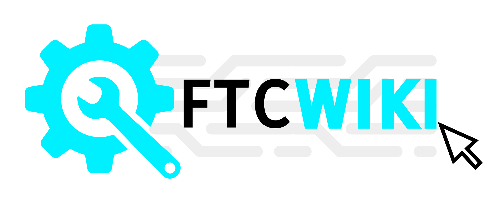

# Welcome to FTC WIKI

<figure><figcaption></figcaption></figure>

**This Wiki’s Purpose**&#x20;

This initiative is designed for current or aspiring _FIRST_ Tech Challenge mechanical members. This guide will outline the beginner and intermediate aspects of _FIRST_ Tech Challenge mechanics. This encyclopedia has been designed for individuals with some experience in building and assembling things, but who are stuck between skill levels where resources are either too basic or just a little above their heads.\

&#x20;Hopefully, by the end of this guide, you will have a deeper understanding of the mechanical aspects of robotics.\

**About us**&#x20;

We are FTC Alumni from Scotch Plains, New Jersey, veteran members of Team 17670 for 4 years, and Team Captains. We’ve both been building for 4 years and are active members in the online FTC community. We have experience with multiple build systems, including Tetrix and Gobilda, and have created many iterations of Swerve drive.

