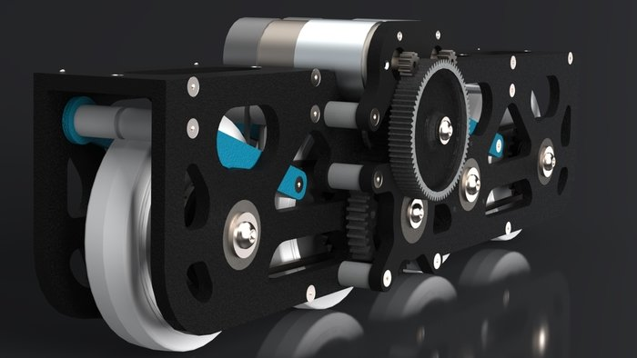

# Custom Mechanisms

<figure><figcaption>
<em>FTC 7244 Out of the Box Robotics 8 Wheel Drive Parallel Plate Gearbox</em>
</figcaption></figure> <figure><figcaption></figcaption></figure>

As you experience FTC and finish a successful kitbot[^1], you will naturally want to experiment and create more unique, interesting, and complicated mechanisms to complete game tasks more efficiently, or reliably. This is a great decision! Custom Mechanisms have shown huge upside potential for teams all over the world, but creating practical systems is no simple task.&#x20;

<figure><figcaption>
Gobilda Kitbot Chassis
</figcaption></figure> <figure><figcaption>
Rev Robotics Kitbot example
</figcaption></figure> <figure><figcaption>
Older Rev Robotics Kitbot
</figcaption></figure>

New mechanism ideologies are being tested everyday from teams all over the world who have the resources, mentorship, and backbone to support advanced development. A popular example of this is Swerve Drive, which is a drivetrain archetype which has become the norm in FRC. Teams in FTC try to literally reinvent the wheel in the name of uniqueness and ambition.&#x20;

If your goal is to create competitive robots which can perform at the State/National and World Championship level, the key to developing custom mechanisms is to balance tried and tested methods along with innovative solutions to game challenges. You can explore each section of this website to learn more about each aspect of FTC Mechanics in order to take your bot from a good starting point to a masterpiece of engineering.

[^1]: A robot build out of assemblies designed by companies for rookie design teams to get started in competition. If it comes with an instruction booklet, It's a Kitbot
