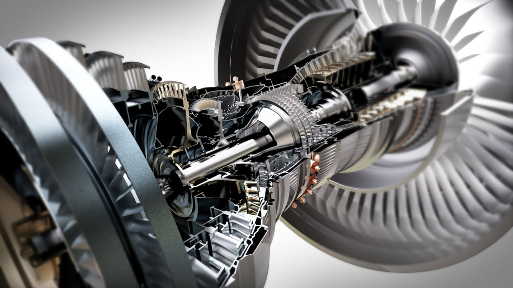

# What is CAD?

CAD, or "Computer-Aided Design," is a powerful software tool utilized across industries by engineers, manufacturers, architects, and designers to transform ideas into reality.&#x20;

It enables the creation of 3D models using various techniques and tools, aiding in prototyping, manufacturing, and product development. CAD files can be sent to machines for printing or material cutting, and detailed drawings can be produced to support manual machining and assembly.&#x20;

For this guide and website, we use Onshape as our CAD platform, but there are many [different types of CAD software](different-types-of-cad-software.md).

<figure><figcaption></figcaption></figure>

## Why use CAD?

With CAD, you can design more advanced custom components and mechanisms. CAD also allows teams to iterate ideas before prototyping and manufacturing, and it helps cut down on prototyping time.&#x20;

Good CAD efficiency can help a team design a good robot early on in the season, leaving more room for software testing and driving practice.&#x20;

1. Using CAD to design your robot ensures that all components fit together seamlessly.
2. With CAD, you can accurately measure your robot's dimensions, making sure it meets the size requirement.
3. CAD serves as both a digital blueprint of your robot and as a bill of materials, helping you during the ordering process by specifying exactly what parts you need.&#x20;
4. CAD skills are highly valuable in various industries and can enhance your resume. Learning CAD with any software builds a strong foundation, making it easier to adapt to other CAD platforms in the future.

