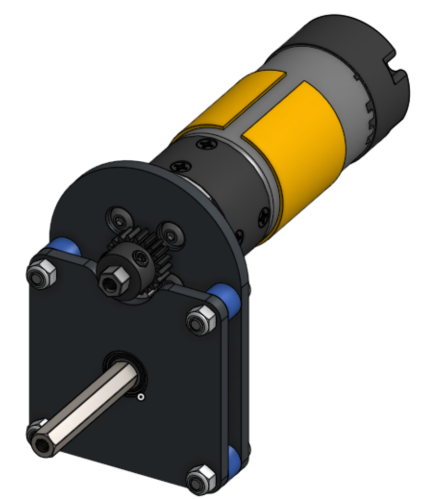
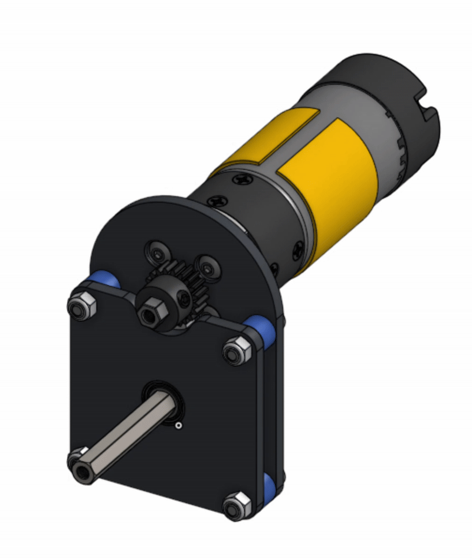

# Exercise #4 Simple Gearbox

### Practice Exercises 

Get ready to practice! Begin by copying the Stage 2B Exercises Document using the button below, just as you did with the Stage 2A Exercises Document. Each exercise is organized into a folder and includes a **"reference" tab**—a preview of the final model—as well as one or two tabs for completing the exercise.&#x20;


[**COPY THIS DOCUMENT**](https://cad.onshape.com/documents/590c0f6b2a80e0dca120c280/w/f3da0f6ce53211134a745ecb/e/f1734caa16f56215c1e2e04f?renderMode=0\&uiState=6849b55e83d04e65c31e0516)


### Exercise 4: Simple Gearbox 

In this exercise, you'll be CADing and assembling a **single-stage gearbox**. The aim is to introduce the basics of designing a simple gear transmission. Along the way, you'll also get hands-on experience with [gears](https://app.gitbook.com/s/D2GXZ5NUEk64Zn6lJiL2/gears), [motors](https://app.gitbook.com/s/D2GXZ5NUEk64Zn6lJiL2/motors), [bearings](https://app.gitbook.com/s/D2GXZ5NUEk64Zn6lJiL2/introduction-to-motion/bearings), c2c, [gear relation](https://app.gitbook.com/s/D2GXZ5NUEk64Zn6lJiL2/gears/gear-ratios), and the [FTC Insert Tool](../../onshape-setup/ftc-insert-tool.md).

#### Layout Sketches 

A **layout sketch** captures the fundamental geometry of a design without locking in precise details. By keeping key dimensions flexible, layout sketches facilitate easy adjustments as the design evolves. Moving forward, we'll rely on layout sketches for nearly all designs.



**Navigate to the "Exercise #4 Simple Gearbox" part studio tab** in the copied document and follow the instructions to complete the part studio.



### Create a Layout Sketch for the Gearbox

<figure><figcaption></figcaption></figure>

Draw pitch diameter circles for the 60-tooth and 20-tooth gears. Make them tangent to define the center-to-center distance between the gears. Then, constrain the gear centers so they align vertically.



### Create a new sketch for the motor plate.&#x20;

<figure><figcaption>
 
</figcaption></figure> <figure><figcaption></figcaption></figure>

Using the layout as the reference, draw an 8mm hole for the bearing and a 14mm hole for the axle that sticks out from the motor. Note that depending on your manufacturing processes and tolerances, you may need to draw your bearing holes slightly larger or smaller.

Add four mounting holes for the motor and four bolt holes for connecting the two plates using center point rectangles. The circular pattern can also be used to duplicate the circles around the square. Make sure that these rectangles are using construction lines, so it doesn't interfere when we extrude (press q on lines to turn them into construction lines).



### Finishing Bottom Plate

<figure><figcaption></figcaption></figure> <figure><figcaption></figcaption></figure>

Using center point rectangles, sketch fillets, and 3-point arcs, outline the plate around the holes and the motor outline.

Extrude the motor plate to be 4mm thick.



### Creating Spacers

<figure><figcaption></figcaption></figure> <figure><figcaption></figcaption></figure>

Create spacers by making the inner diameter 4mm and making the outer diameter the same as the sketch fillet.

Then, extrude the spacer by 7mm.



### Creating Top Plate

<figure><figcaption></figcaption></figure> <figure><figcaption></figcaption></figure>

By using the Use tool (the cube), you can copy the geometry and holes of the motor plate. Then add a 20mm diameter circle, a line connecting both of the top mounting holes to the circle, and sketch fillets.

Then extrude by 4mm, and fillet the edges of the semi-circle by 5mm.



### Countersinking Screw Mounts

<figure><figcaption></figcaption></figure> <figure><figcaption></figcaption></figure>

Now create holes for the screws by making circle with a diameter 8mm, extruding them by 2mm, and fillet them by 0.5mm.



### Creating a Gear

<figure><figcaption></figcaption></figure> <figure><figcaption></figcaption></figure>

You can create a gear by looking up "Spur Gear" in the "Search tools" search bar. Make the gear have 60 teeth, make it 5mm deep, and make its module 0.8. You can also hide the top plate for a better view of the gear.


All GoBILDA gears have a module of 0.8mm


Then create the center REX bore by using the circumscribed polygon tool and making a 6-sided shape with a diameter of 8mm.



### Finished Part Studio

<figure><figcaption></figcaption></figure>

Now the part studio is finished, and you can move on to the assembly.





**Navigate to the "Exercise #4 Simple Gearbox" assembly tab** in the copied document and follow the instructions to complete the assembly studio.



### Starting the assembly

<figure><figcaption></figcaption></figure> <figure><figcaption></figcaption></figure>

Import the top and bottom plates as well as the spacer. Mate the spacer to the bottom plate, and use the "replicate" tool to copy the spacers. Then mate the top plate to the spacers.



### Import Parts using the FTC Insert Tool

<figure><figcaption></figcaption></figure> <figure><figcaption></figcaption></figure>

Insert the Bearings and the axle from the FTC Insert tool, as well as the gear from the part studio. Then, mate the bearing to the bottom plate, and mate the gear to the rotating part of the bearing. Mate the other bearing to the top plate and then mate it to one of the spacers.



### Import the rest of the Parts

<figure><figcaption></figcaption></figure> <figure><figcaption></figcaption></figure>

Import the rest of the parts, and mate the 20-tooth gear onto the rotating shaft. Then mate the screws and use the replicate tool to replicate the screw mates.



### Gear Relation

<figure><figcaption></figcaption></figure> <figure><figcaption></figcaption></figure>

Create a gear relation by choosing the two revolute mates that are mated to your gears. You can do this by clicking on the motor and the bearing dropdowns and going to mates, where you click the revolute mate. Now, calculate the [gear ratio](https://app.gitbook.com/s/D2GXZ5NUEk64Zn6lJiL2/gears/gear-ratios) and reverse the direction.




