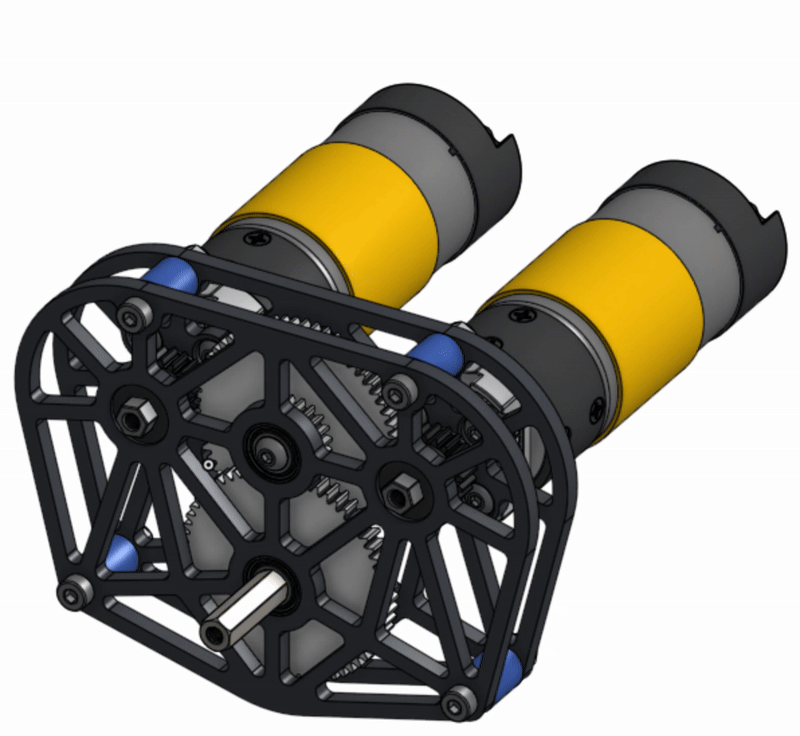

# Exercise #5 Two-Stage Gearbox

### Exercise 5: Two-Stage Gearbox

In this exercise, you'll be CADing and assembling a **two-stage gearbox**. The goal is to build experience with more advanced gearbox designs. Additionally, you'll learn how to use the[ **Part Lighten Featurescript**](../../featurescripts.md#part-lighten) to optimize and reduce weight in your components.



**Navigate to the "Exercise #5 Two-Stage Gearbox" tab** in the copied document and follow the instructions to complete the part studio.



### Create a Layout Sketch

<figure><figcaption></figcaption></figure>

Draw pitch diameter circles for the 60-tooth and 20-tooth gears. Make them tangent to define the center-to-center distance between the gears. Then, constrain the gear centers so they align vertically and horizontally.



### Create a new sketch for the motor plate. 

<figure><figcaption></figcaption></figure> <figure><figcaption></figcaption></figure>

Using the layout as the reference, draw 14mm holes for the bearings. Note that depending on your manufacturing processes and tolerances, you may need to draw your bearing holes slightly larger or smaller.

Add four mounting holes for connecting the motor plates, and begin adding circles to create the geometry of the plate.



### Finishing Top Plate 

<figure><figcaption></figcaption></figure> <figure><figcaption></figcaption></figure>

Using center lines, sketch fillets, 3-point arcs, and the mirror tool, finish sketching the geometry of the top plate.

Extrude the motor plate to be 4mm thick.



### Creating Spacers

<figure><figcaption></figcaption></figure> <figure><figcaption></figcaption></figure>

Create spacers by making the inner diameter 4mm and making the outer diameter the same as the sketch fillet.

Then, extrude the spacer by 12 mm.



### Creating Bottom Plate 

<figure><figcaption></figcaption></figure> <figure><figcaption></figcaption></figure>

By using the "Use" tool (the cube), you can copy the geometry and holes of the top motor plate. Then add a 16x16mm center point rectangle for the motor mount and mirror it to the other side.

Then, extrude by 4mm.



### Countersinking Screw Mounts 

<figure><figcaption></figcaption></figure> <figure><figcaption></figcaption></figure>

Now create holes for the screws by making circle with a diameter 8mm, extruding them by 2mm, and fillet them by 0.5mm.



### Creating the gears

<figure><figcaption></figcaption></figure> <figure><figcaption></figcaption></figure>

Make the gear have 60 teeth, make it 5mm deep, and make its module 0.8. You can also hide the top plate for a better view of the gear.

Make a second gear with 20 teeth, and 5mm deep, and make its module 0.8 as well.



### Pocketing the Top Plate

<figure><figcaption></figcaption></figure> <figure><figcaption></figcaption></figure>

In order to pocket the plates, make sure to make a new sketch and create rib lines. Now use the "Part Lighten" Feature Scripts and click on the top plate and the new sketch you created for the rib lines.



### Pocket Bottom Plate

<figure><figcaption></figcaption></figure> <figure><figcaption></figcaption></figure>

To pocket the other plate, click the face of the bottom plate, and use the same rip line sketch for the bottom plate's rib lines.



### Gear Spacer and Finished Part Studio

<figure><figcaption></figcaption></figure> <figure><figcaption></figcaption></figure>

Create a new sketch, draw a 10mm circle, and using the circumscribed polygon tool and make a 6-sided shape with a diameter of 8mm.

Extrude by 5mm, and you can start the [assembly](exercise-5-two-stage-gearbox.md#assembly-instructions).





**Navigate to the "Exercise #5 Two-Stage Gearbox" assembly tab** in the copied document and follow the instructions to complete the assembly studio.



### Starting the assembly 

<figure><figcaption></figcaption></figure> <figure><figcaption></figcaption></figure>

Import the top plates, bottom plates, spacer, and the gears. Mate the spacer to the bottom plate, and use the "replicate" tool to copy the spacers. Then mate the top plate to the spacers.



### Import Parts using the FTC Insert Tool 

<figure><figcaption></figcaption></figure> <figure><figcaption></figcaption></figure>

Import the bearings, an 8mm standoff, and a 58mm axle. Once mated to the bottom plate, add the gears, the gear spacer, and the final bearings.



### Import the remaining Parts

<figure><figcaption></figcaption></figure> <figure><figcaption></figcaption></figure>

Import the rest of the parts, and mate the 20-tooth gears onto the rotating shaft. Then mate the screws and use the replicate tool to replicate the screw mates.

Don't forget to add screws to the standoff to hold it in place.



### Gear Relation

<figure><figcaption></figcaption></figure> <figure><figcaption></figcaption></figure>

Now, create 3 different gear relations by choosing the two revolute mates that are mated to your gears. You can do this by clicking on the motor and the bearing dropdowns and going to mates, where you click the revolute mate. Now, calculate the [gear ratio](https://www.ftcwiki.org/transmitting-power/gears/gear-ratios) and reverse the direction.





