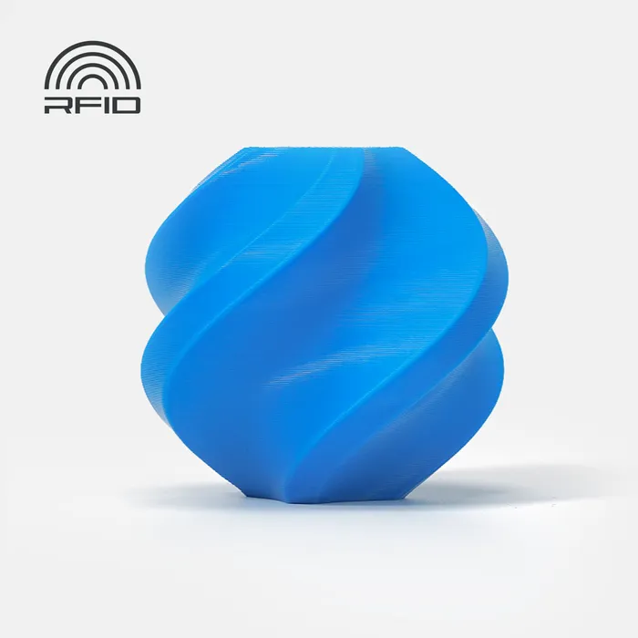
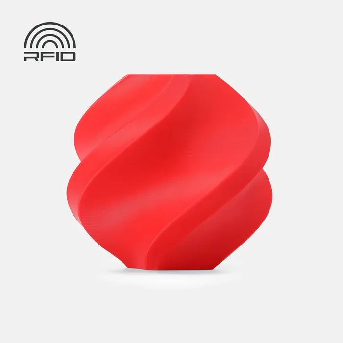
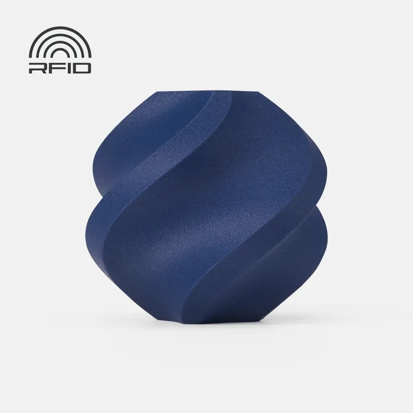
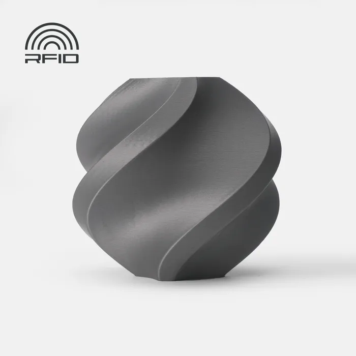
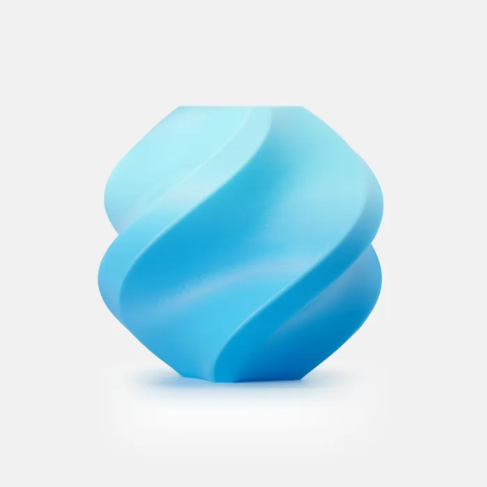
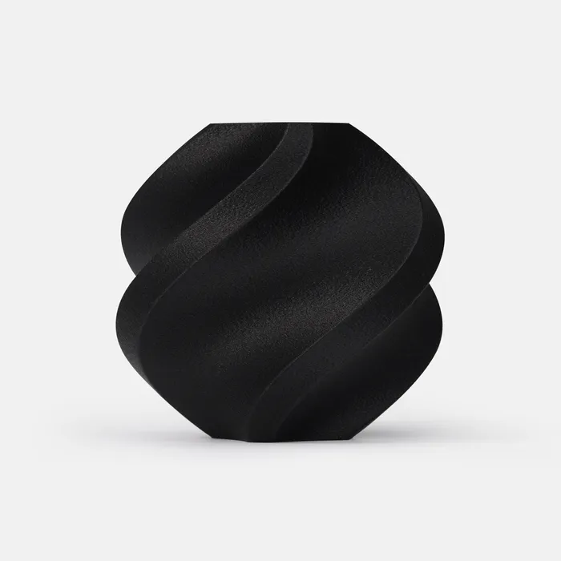
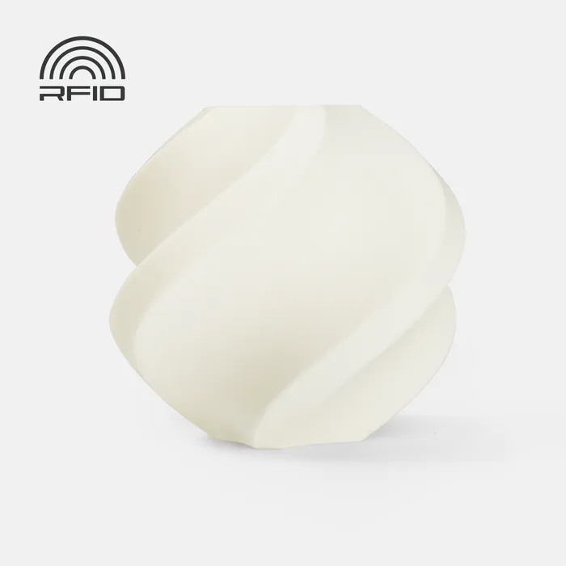
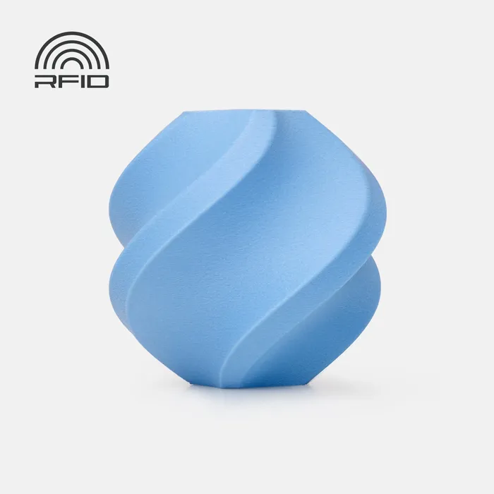

# Filaments

FDM 3D printers use material called filament. It's a thin plastic wire that comes on a spool and is fed into the printer. Most filament is plastic, however, there are also metal, composite and rubber filaments.



For almost every part that needs to be 3D printed for FTC, PLA and/or PETG will meet all the needs for strength, durability, and aesthetics. These two filament types are by far the easiest to print, and are sold by many manufacturers for reasonable prices. Most of the other filaments here offer very specific advantages (like TPU) that come at the cost of effort, time, and money.

|                                                                                                                                                                                                                                                                                                                                                                                                                                                                                                                                                                                                                                                                                                      |                                                                                                                                                                                         |
| ---------------------------------------------------------------------------------------------------------------------------------------------------------------------------------------------------------------------------------------------------------------------------------------------------------------------------------------------------------------------------------------------------------------------------------------------------------------------------------------------------------------------------------------------------------------------------------------------------------------------------------------------------------------------------------------------------- | --------------------------------------------------------------------------------------------------------------------------------------------------------------------------------------- |
| 
<strong>PLA (Polylactic Acid) ></strong>

The most common 3D Printing filament is polylactic acid, or PLA. It is a plastic made from biological sources like corn starch and sugar cane. PLA is stiff but more brittle than other filament options and tends to have little to no warp when printing. PLA is well suited to the majority of robot parts, but it may not hold up well to shock loads (impacts to parts), and as such, parts should be designed accordingly.
                                                                                                                                                                                                               | 

<figure><figcaption>
<em>Bambu Lab PLA Basic</em>
</figcaption></figure>
                       |
| 

<strong>PETG (Polyethylene Terephthalate Glycol) ></strong>

PETG can be described as a strength upgrade to PLA. It is not difficult to print, but it often has noticeably more stringing and other minor artifacts. While it technically has a lower tensile strength than PLA, it is far less brittle and withstands impacts better, through slight flexing. It is a great option for FTC parts that need to be impact resistant, where PLA will not suffice. Its higher temperature resistance also means it won’t warp in a high ambient temperature, such as a hot car.
                                                                                                      | 

<figure><figcaption>
<em>Bambu Lab PETG</em>
</figcaption></figure>
 |
| 

<strong>PETG-CF (Carbon Fiber Reinforced PETG) ></strong>

PETG-CF is a PETG filament that has been reinforced with short strands of carbon fiber. This results in a material that is stiffer and lighter than regular PETG, with reduced flex and greater dimensional stability. Parts printed with PETG-CF are stronger and more rigid, making them ideal for structural parts where PLA or PETG may bend or deform. However, this filament is abrasive and will wear out brass nozzles quickly, so a hardened steel is highly recommended. Surface finish is usually matte and very appealing, but the filament is more expensive and slightly more brittle than regular PETG.
 | 

<figure><figcaption>
<em>Bambu Lab PETG-CF</em>
</figcaption></figure>
                         |




These filaments are less commonly used than those listed above, but can still find plenty of use cases on an FTC robot. These are usually used due to specific material properties such as flexibility or durability. These often come however, with substantial obstacles for printing that prevent some printers from printing them out of the box, along with sometimes being significantly more expensive.

|                                                                                                                                                                                        |                                                                                                                                                                                                                                                                                                                                                                                                                                                                                                                                                                                                                                                                                     |
| -------------------------------------------------------------------------------------------------------------------------------------------------------------------------------------- | ----------------------------------------------------------------------------------------------------------------------------------------------------------------------------------------------------------------------------------------------------------------------------------------------------------------------------------------------------------------------------------------------------------------------------------------------------------------------------------------------------------------------------------------------------------------------------------------------------------------------------------------------------------------------------------- |
| 

<figure><figcaption>
<em>Bambu Lab ABS</em>
</figcaption></figure>
                              | 

<strong>ABS (Acrylonitrile Butadiene Styrene) ></strong>

ABS used to be the standard filament for printing before PLA became commercially available. You’ve probably used ABS before in LEGO® pieces. It can withstand high loads and is quite ductile. This comes at the cost of printing difficulty, where an enclosure is often necessary to raise the ambient temperature and prevent severe part warping. The strength improvements over PLA can be more easily found in PETG, so ABS parts are not as common in FTC. ABS is quite affordable, though, sold at the same prices as PLA.
                                                                     |
| 

<figure><figcaption>
<em>Bambu Labs TPU</em>
</figcaption></figure>

                  | 
<strong>TPU (Thermoplastic polyurethane) ></strong>

TPU is a common printing filament that is widely used for its flexible material properties. This allows one to create printed parts that can easily flex and bend. Sold under many different durometers (a measure on the Shore Hardness Scale of the hardness/flexibility of a material), TPU/TPE’s high impact resistance and layer adhesion make it not only a versatile filament, but an extremely durable one. In FTC, teams use TPU/TPE in roles such as printed intake flaps in place of a tube, as well as custom belts for low-load applications.
                                                         |
| 

<figure><figcaption>
<em>Bambu Lab PA6-CF (Nylon-based)</em>
</figcaption></figure>

         | 

<strong>Nylon-Based Filaments ></strong>

Nylon is a high-performance engineering plastic known for its excellent strength, flexibility, and wear resistance. It can absorb shock loads well and has great layer adhesion, making it useful for FTC parts like gears, spacers, or slide components that need to resist abrasion and impacts. Nylon does tend to absorb moisture from the air (hygroscopic), which can compromise print quality unless dried before use. It also tends to warp significantly and may require an enclosure. Despite the print challenges, it is one of the most durable and functional materials available for FDM printers.
       |
| 

<figure><figcaption>
<em>Bambu Lab ASA (Polycarbonate-based)</em>
</figcaption></figure>
      | 

<strong>Polycarbonate-based Filaments ></strong>

Polycarbonate (PC) is one of the toughest materials available for desktop 3D printing. It boasts excellent strength, impact resistance, and high temperature tolerance—ideal for parts exposed to mechanical stress or heat. PC is significantly stronger than PLA, PETG, or even ABS, but it is also one of the most difficult materials to print, requiring high nozzle temperatures (over 270°C), a heated bed, and often an enclosure to prevent cracking and warping. Due to these challenges, it is typically only used when its high-performance properties are necessary.
                              |
| 

<figure><figcaption>
<em>Bambu Lab PA6-GF (Glass-based)</em>
</figcaption></figure>

 | 
<strong>Glass-based Filaments ></strong>

Glass-filled filaments are standard materials like Nylon or PETG that have been reinforced with short strands of fiberglass. These composites increase rigidity and reduce material shrinkage, resulting in parts with very high dimensional accuracy and stability. They are excellent for structural applications where flexing is undesirable. Similar to carbon fiber filaments, glass-filled filaments are abrasive and require a hardened nozzle. While they are not as widely used in FTC due to cost and print difficulty, they can be invaluable for producing strong, precise brackets and mounts under high loads.
 |


