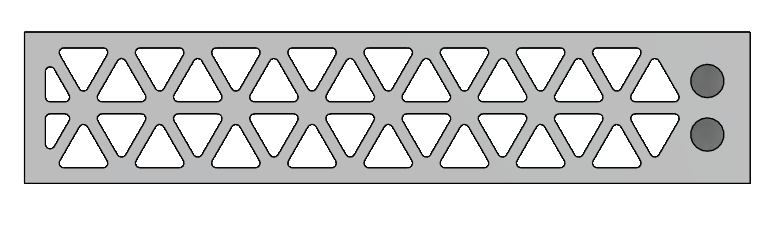
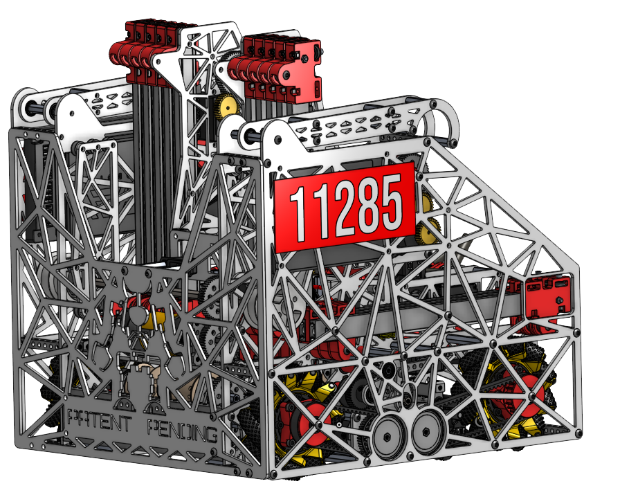

# Weight Savings (Pocketing)

**Pocketing >**&#x20;

To reduce weight without compromising structural integrity, teams often incorporate pocketing patterns into parts, a technique commonly called pocketing or lightening. These pockets remove excess material while maintaining the structural integrity. When designing pockets to reduce weight, it's important to consider the forces the part will experience and the key areas needing extra support, like bearing and bolt holes. A good pocketing design keeps the part strong while making it lighter, ensuring it works reliably and lasts longer.

<figure><figcaption>
FTC 17670 - Our First Parallel Plate Chassis Design used at NJ State Championship
</figcaption></figure>

**Designing for Pocketing Patterns >**

When creating pocketing patterns, remember that triangles are the strongest shape. Sharp corners should be avoided, as they can lead to cracks or tears. Adding rounded edges helps prevent these issues.  When cutting parts on a waterjet or a laser cutter, the rounds can be almost any size.\

It is best to wait until the very end of your design to create patterns, otherwise, you will likely waste a lot of time when changing things on your parts.

***

**Types of Pocketing Patterns >**

**Triangles >**

As stated previously, triangles are the strongest shape. Triangles are also typically used on box tubes that are less than 2 inches in dimension, since milling isogrid on parts smaller than that usually requires small endmills and increases machining time.\

<figure><figcaption>
<em>Triangle Pocketing example</em>
</figcaption></figure>

**Circles >**

Circles are the easiest pocket patterns to machine as they can be machined on a drill press, if necessary. Circles are also easy to draw and can even make parametric. Many teams end up drilling circular holes in their robot late in the build season, when they realize their robot is overweight.

**Pocketing non-standard part >**

For parts with multiple bearings and bolt holes, it's important to connect them to the rest of the structure using struts, allowing loads to be evenly distributed. Ensure there's enough material surrounding the bearings, bolt holes, and the outer edges to provide proper support. The strongest approach is to arrange the struts in a triangular pattern. If you have a large, open rectangular section, consider adding a strut to divide it into two triangles for better load distribution and stability.

<figure><figcaption>
Sohm Shah from 11285 PATENT PENDING <em>pocketed parallel plates.</em>
</figcaption></figure>

A way to configure your pocketing pattern is to use a generator, such as [Voronoi Editor](https://voronoi-editor.web.app/), which creates optimized cutout patterns in a part.
